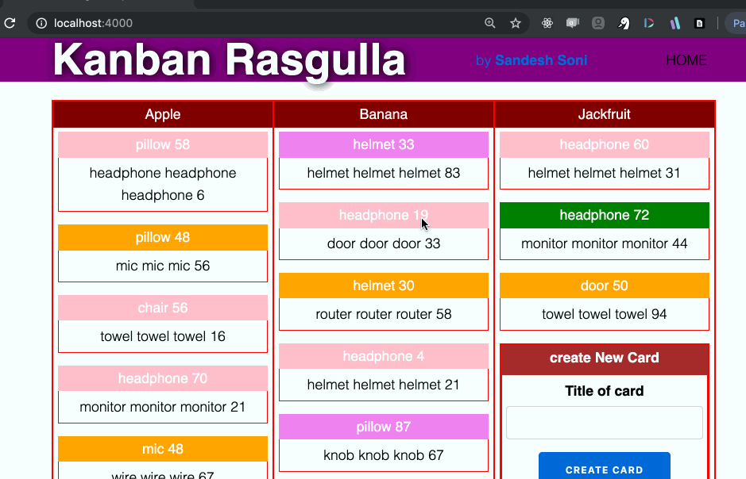

# Kanban Rasgulla

Kanban Board built using Elixir and Phoenix LiveView, using LiveView Hooks.

Rasgulla is a sweet dish/ Dessert. [wikipedia](https://en.wikipedia.org/wiki/Rasgulla)

## Code can be found inside folder named`Server`

 - Random data is generated on every new instance. Board has a few columns and column has cards. 
 - Create new Card from form data.
 - Move Card from one column to Another.
 - Move card across same column(BUG).
 - Card has its own color [Classification].
 - Card move logic needs to be fixed and use index values.
 
 ## Next features can be implemented in future
 - Implement Realtime Kanban board, moved card should change across all sessions.
 - create User. A user can own multiple boards.
 - Users can share boards with other users.
 - Existing Card can have button which toggles Card update form..
 - We drop Card on Card. If Card is dropped on Column/Empty column, card should be added to column, Add functionality.
 - Genserver. It was planned, data will stored in Genserver and the move card logic will be implemented in GenServer.
 - For now random data is used. After implemeting User and Kanban owners, consider integrating with a database.

## Improvements needed.
- Performance - length of data transfer on socket reply is around 5k for move card, add card. Debug to bring it down.
- The nested Access behaviour callback - pop_in, get_and_update_in, fetch_in. Expert advice needed for improvement.

## Code is inside folder named`Server`

# LiveView Version 0.3 <- IMPORTANT
# Elixir 1.9 and Erlang 22 is Used.

To start your Phoenix server:

  * Install dependencies with `mix deps.get`
  * Create and migrate your database with `mix ecto.setup`
  * Install Node.js dependencies with `cd assets && npm install`
  * Start Phoenix endpoint with `mix phx.server`

Now you can visit [`localhost:4000`](http://localhost:4000) from your browser.

If you wait for longer time and unending spinner is visible, need to refresh the page.

